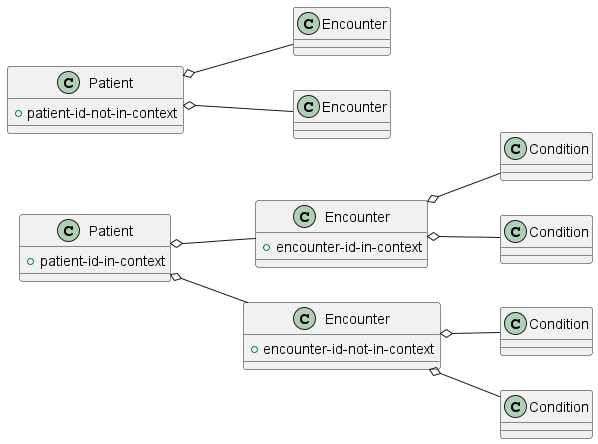

 <br/> 

# ISIK Sicherheit Stufe 3 Testsuite

<details>
  <summary>Table of Contents</summary>
  <ol>
    <li>
      <a href="#about-the-project">About The Project</a>
       <ul>
        <li><a href="#release-notes">Release Notes</a></li>
      </ul>
	</li>
    <li>
      <a href="#getting-started">Getting Started</a>
      <ul>
        <li><a href="#prerequisites">Prerequisites</a></li>
        <li><a href="#installation">Installation</a></li>
      </ul>
    </li>
    <li><a href="#usage">Usage</a></li>
    <li><a href="#contributing">Contributing</a></li>
    <li><a href="#license">License</a></li>
    <li><a href="#contact">Contact</a></li>
  </ol>
</details>

## About The Project
This is a test suite for conformance tests according to the [ISIK Sicherheit Stufe 3 specification](https://simplifier.net/guide/isik-sicherheit-v3?version=current).

### Release Notes
See [ReleaseNotes.md](./ReleaseNotes.md) for all information regarding the (newest) releases.

## Getting Started

### Prerequisites

1. This testsuite, which you can get either by cloning this repository or downloading the latest release.
2. An ISIK resource server (System under Test, SUT) that is compliant with the ISIK Sicherheit Stufe 3 specification.
3. An authorization server, which is compliant with the ISIK Sicherheit Stufe 3 specification. The authorization server is required to obtain access tokens with various scopes as required by the test cases. The authorization server should support at least _confidential asymetric_ client authentication.   
4. Test resources within the resource server to be used in the tests (see [Installation](#installation)) 
5. Test configuration within the authorization server to be used for client authentication (testsuite acts as a client) 

Operating system requirements:

- Open JDK >= 17
- Maven >= 3.6

### Installation

#### Test environment
Configure the endpoint of the SUT using the configuration elements `env.fhir-server-base-url` and `env.fhir-server-path` from the `testcases/user-settings.yaml` configuration file. Example:

```yaml
env:
  fhir-server-base-url: http://localhost:8080
  fhir-server-path: /fhir/
```

#### Test resources
Create the following test resources in the SUT and put their corresponding IDs into the `testcases/user-settings.yaml` configuration file:



Example:

```yaml
testresources:
  patient-id-in-context: "85"
  patient-id-not-in-context: "355"
  encounter-id-in-context: "333"
  encounter-id-not-in-context: "666"
```


#### Client credentials
Configure the client credentials used for test suite authentication in the `testcases/user-settings.yaml` configuration file. Example:

```yaml
authz-credentials:
  asym-client-id: "some-id"
  authz-asym-client-jwt-key: |
    {
    "keys":
      [
        {
          "kty": "RSA",
          "alg": "RS384",
          "n": "...",
          "e": "AQAB",
          "d": "...",
          "p": "...",
          "q": "...",
          "dp": "...",
          "dq": "...",
          "qi": "...",
          "key_ops": [
            "sign"
          ],
          "ext": true,
          "kid": "..."
        }]
    }
```

## Usage

To start one or several particular test cases run `mvn verify -Dcucumber.filter.tags="@TEST_NAME1 or @TEST_NAME2"`, e.g. `mvn verify -Dcucumber.filter.tags="@EncounterContext or @PatientLevelScope"`. To start the complete test suite run `mvn verify`. 

By default a browser window will open, which provides an overview of the testing progress. See [Tiger Workflow UI](https://gematik.github.io/app-Tiger/Tiger-User-Manual.html#_tiger_user_interfaces) for further information about the user interface. To run the testsuite without the GUI, i.e. within a CI/CD pipeline, set the configuration element `lib.activateWorkflowUi` to `false` in the `testcases/tiger.yaml` configuration file.

Some test cases require user interaction and open a new browser window. This is required to let the user authenticate by the authorization server and delegate his rights to access test resources to the test suite. Once the user confirmed the delegation, the test suite will continue with the test case and the browser window can be closed.    

## Contributing
If you want to contribute, please check our [CONTRIBUTING.md](./CONTRIBUTING.md).

## License

Copyright 2024 gematik GmbH

Licensed under the Apache License, Version 2.0 (the "License"); you may not use this file except in compliance with the License.

See the [LICENSE](./LICENSE) for the specific language governing permissions and limitations under the License.

Unless required by applicable law the software is provided "as is" without warranty of any kind, either express or implied, including, but not limited to, the warranties of fitness for a particular purpose, merchantability, and/or non-infringement. The authors or copyright holders shall not be liable in any manner whatsoever for any damages or other claims arising from, out of or in connection with the software or the use or other dealings with the software, whether in an action of contract, tort, or otherwise.

The software is the result of research and development activities, therefore not necessarily quality assured and without the character of a liable product. For this reason, gematik does not provide any support or other user assistance (unless otherwise stated in individual cases and without justification of a legal obligation). Furthermore, there is no claim to further development and adaptation of the results to a more current state of the art.

Gematik may remove published results temporarily or permanently from the place of publication at any time without prior notice or justification.

## Contact

Please open a GitHub issue or a ticket within [Anfrageportal ISiK](https://service.gematik.de/servicedesk/customer/portal/16) for any questions or feedback.
